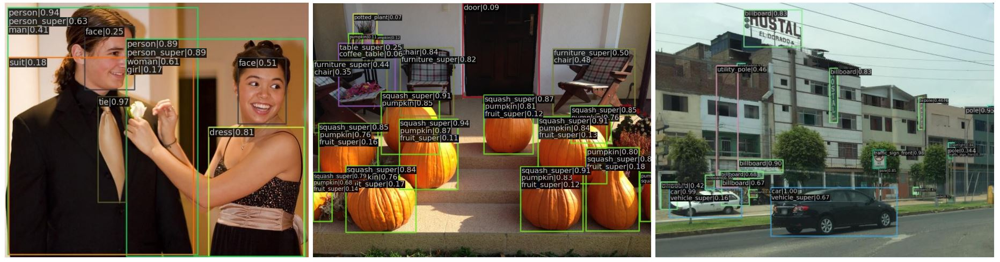
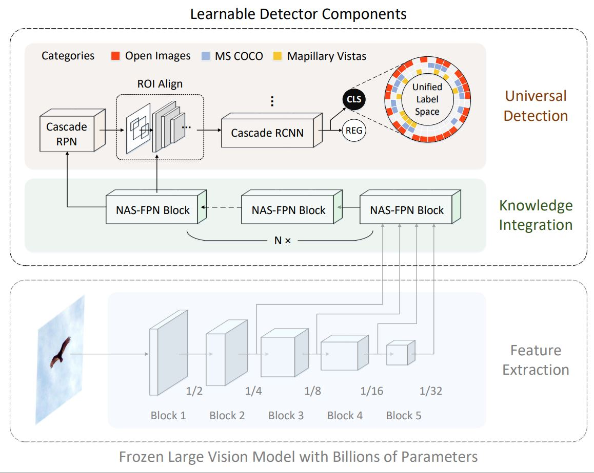

# Large-UniDet
A practice for million-scale multi-domain universal object detection.   
The 2nd place (**IFFF_RVC**) in ECCV 2022 [Robust Vision Challenge (RVC 2022)](http://www.robustvision.net/leaderboard.php?benchmark=object).

<p align="center">  </p>

> [**Million-scale Object Detection with Large Vision Model**](https://arxiv.org/abs/2212.09408),   
> Feng Lin, Wenze Hu, Yaowei Wang, Yonghong Tian, Guangming Lu, Fanglin Chen, Yong Xu, Xiaoyu Wang

Contact: [lin1993@mail.ustc.edu.cn](mailto:lin1993@mail.ustc.edu.cn). Feel free to contact me if you have any question!

## Overview
<p align="left">  </p>

## Installation

Our project works with [mmdetection](https://github.com/open-mmlab/mmdetection) **v2.25.1** or higher. Please refer to [Installation](https://github.com/open-mmlab/mmdetection/blob/master/docs/en/get_started.md/#Installation) for installation instructions.

We build the experimental environment via [docker](https://docs.docker.com/engine). We also provide [DockerImage](https://pan.baidu.com/s/1hgFDnfTz9AqGrCLwFau0tg) (fetch code: **26yc**).

## Data Preparation

- **Datasets**

  Step 1: Download the [devkits](https://github.com/ozendelait/rvc_devkit) provided by the RVC organizers.
  
  Step 2: Place the devkits folder under our project main folder as below:
  ~~~
  $ROOT/
    rvc_devkit-master/
  ~~~
  
  Step 3: Use this devkits to prepare three dataset: MS COCO, OpenImages, and Mapillary Vistas.
  
  Link the processed datasets to ```$ROOT/data/rvc```, the datasets as below:
  ~~~
  $ROOT/
    data/
      rvc/
        coco/
          annotations/
          images
            train2017/
            val2017/
            test2017/
        oid/
          annotations/
          train_0/
          train_1/
          ...
          train_f/
        mvd/
          annotations/
          training/
          validation/
          testing/
  ~~~

- **Large Vision Models**

  Step 1: Download the [SEER](https://github.com/facebookresearch/vissl/tree/main/projects/SEER) models ([RegNet32gf](https://dl.fbaipublicfiles.com/vissl/model_zoo/seer_regnet32d/seer_regnet32gf_model_iteration244000.torch) and [RegNet256gf](https://dl.fbaipublicfiles.com/vissl/model_zoo/swav_ig1b_cosine_rg256gf_noBNhead_wd1e5_fairstore_bs16_node64_sinkhorn10_proto16k_apex_syncBN64_warmup8k/model_final_checkpoint_phase0.torch)) and convert them to the *mmdet* format. 
  ```
  # convert the downloaded checkpoints
  seer = torch.load("seer_model_name.torch", map_location="cpu")
  state_dict = {"state_dict": seer["classy_state_dict"]["base_model"]["model"]["trunk"]}
  torch.save(state_dict, FILENAME)
  ```
  Step 2: Link the processed checkpoints to ```$ROOT/checkpoints```
  
  **Note**:
  
  The processed checkpoints are provided [here]() (fetch code: **xxxx**).
  
- **Label Hierarchy Files**

  Do not need to do anything for this, we provide the label hierarchy files for *HierarchyLoss* in ```$ROOT/label_spaces```.
  
  **Note**:
  
  If you want to generate the label hierarchy files by yourself, run the script as below:
  ```
  # generate the label hierarchy files
  cd ./label_spaces
  python gen_hierarchy.py
  ```
  
- **Evaluation Tools**  
  
  Do not need to do anything for this, all the scripts are prepared in our project main folder.
  
  **Note**:
  
  1. We have downloaded [openimages2coco](https://github.com/bethgelab/openimages2coco) and placed the folder as ```$ROOT/openimages2coco-master```.
  
  2. We have simplified the [Tensorflow Object Detection API](https://github.com/tensorflow/models/blob/master/research/object_detection/g3doc/challenge_evaluation.md#object-detection-track) and placed the scripts in ```$ROOT/tools/eval_tools/oid```.
 
## Training

- To train the SEER-RegNet32gf-based Large-UniDet on 8 GPUs, use the following command line

  ```
  bash tool/dist_train.sh configs/rvc/cascade_rcnn_nasfpn_crpn_32gf_1x_rvc.py 8
  ```
- To train the SEER-RegNet256gf-based Large-UniDet on 8 GPUs, use the following command line

  ```
  bash tool/dist_train.sh configs/rvc/cascade_rcnn_nasfpn_crpn_256gf_1x_rvc.py 8
  ```
- To conduct the dataset-specific finetuning on MS COCO, use the following command line

  ```
  bash tool/dist_train.sh configs/rvc/finetune/cascade_rcnn_nasfpn_crpn_32gf_2x_coco.py 8
  ```
  
## Evaluation
- To perform evaluations on MS COCO *val* set, run
  ```
  bash tool/dist_test.sh configs/rvc/finetune/cascade_rcnn_nasfpn_crpn_32gf_2x_coco.py CHECKPOINT 8 --eval bbox
  ```
  
- To perform evaluations on Mapillary Vistas *val* set, run
  ```
  bash tool/dist_test.sh configs/rvc/finetune/cascade_rcnn_nasfpn_crpn_32gf_2x_mvd.py CHECKPOINT 8 --eval bbox
  ```
  
- To perform evaluations on OpenImages *val* set, run
  ```
  # generate the predictions for OpenImages
  bash tool/dist_test.sh configs/rvc/finetune/cascade_rcnn_nasfpn_crpn_32gf_0.5x_oid.py CHECKPOINT 8 --format-only --eval-options jsonfile_prefix=$ROOT/results/oid
  # remap the unified predictions into the label space of OpenImages
  python rvc_devkit-master/common/map_coco_back.py --predictions $ROOT/results/oid.bbox.json --annotations ./data/rvc/oid/annotations/openimages_challenge_2019_val_bbox.json --mapping ./label_spaces/obj_det_mapping_540.csv --mapping_row oid_boxable_leaf --map_to freebase_id --void_id 0 --remove_void --reduce_boxable --output $ROOT/results/remapped_oid.bbox.json
  # convert the JSON format to the CSV format
  python openimages2coco/convert_predictions_custom.py -p $ROOT/results/remapped_oid.bbox.json --subset validation
  # do evaluation
  cd tool/eval_tools/oid
  sh eval.sh $ROOT/results/remapped_oid.bbox.csv $ROOT/results/mAP
  ```
  See the accuracy in the first row of ```$ROOT/results/mAP```

## Model Zoo

  We provide a zoo of the trained unified object detectors as below:
  | Model                              | MS COCO | OpenImages | Mapillary | weights |
  |------------------------------------|---------|------------|-----------|---------|
  | Large-UniDet [SEER-RegNet32gf]     | 48.8    | 68.5       | 25.9      |[config](configs/rvc/cascade_rcnn_nasfpn_crpn_32gf_1x_rvc.py) / [weights]() (fetch code: **xxxx**)|
  | Large-UniDet [SEER-RegNet256gf]    | 51.9    | 69.8       | 27.7      |[config](configs/rvc/cascade_rcnn_nasfpn_crpn_256gf_1x_rvc.py) / [weights]() (fetch code: **xxxx**)|

## License

See the [LICENSE](LICENSE) file for more details.

## Citation

If you find this project useful in your research, please cite:

    @article{lin2022million,
      title={Million-scale Object Detection with Large Vision Model},
      author={Lin, Feng and Hu, Wenze and Wang, Yaowei and Tian, Yonghong and Lu, Guangming and Chen, Fanglin and Xu, Yong and Wang, Xiaoyu},
      journal={arXiv preprint arXiv:2212.09408},
      year={2022}
    }
